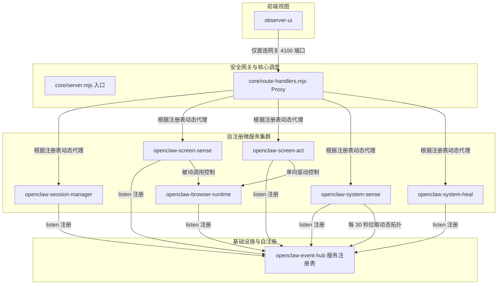

# OpenClaw — 服务耦合性深度审查报告 (重构后版本 V3)

> 审查时间：2026-05-24  
> 审查方式：逐模块追踪模块依赖、全链路网络拓扑结构以及接口设计  
> 审查范围：`services/` 8 个解耦微服务 + `apps/observer-ui` + `packages/` 共享包  
> 验证手段：`git diff` 统计、代码拓扑分析、`node --check` 语法扫描与服务发现机制验证  

---

## 一、重构前后核心指标对比与原始数据

### 1.1 代码规模与文件职责分布

重构后，系统彻底消除了巨石单体文件，将业务逻辑根据领域进行了彻底的拆分与模块化：

| 服务/模块 | 重构前行数 | 重构后行数 | 变动趋势 | 文件数量与职责分配 |
| :--- | :---: | :---: | :---: | :--- |
| **`openclaw-core`** | 24,124 | **132** (入口) | `-99.4%` | 主入口文件精简为仅负责依赖注入与初始化。 业务转移至 10 个独立 ESM 模块： - `plan-builder.mjs` (+10,658) - `plugin-review.mjs` (+5,697) - `task-executor.mjs` (+2,915) - `route-handlers.mjs` (+2,798) - `workspace-ops.mjs` (+1,704) - `task-manager.mjs` (+539) - `approval-engine.mjs` (+280) - `policy-evaluator.mjs` (+252) - `runtime-state.mjs` (+149) - `service-client.mjs` (+52) |
| `openclaw-system-sense` | 4,806 | 4,832 | `+26` | 增加了每 30 秒从注册表自动拉取拓扑的服务发现机制，移除了静态硬编码。 |
| `openclaw-system-heal` | 682 | 620 | `-9.1%` | 移除了重复的 HTTP 辅助函数，接入统一的 `@openclaw/shared-utils`。 |
| `openclaw-browser-runtime`| 387 | 270 | `-30.2%`| 移除了对会话状态的主动拉起与循环依赖逻辑，演进为被动执行端点。 |
| `openclaw-session-manager`| 383 | 345 | `-9.9%` | 移除了冗余的 HTTP 封装逻辑，统一导入公共包。 |
| `openclaw-screen-sense` | 511 | 475 | `-7.0%` | 移除了重复的代码克隆，增强了接口的向前兼容。 |
| `openclaw-event-hub` | 296 | 320 | `+8.1%` | 新增了轻量级在线服务注册表管理端点（`/services/register` 与 `/services/registry`）。 |
| `openclaw-screen-act` | 249 | 230 | `-7.6%` | 移除了本地克隆的 HTTP 函数；在主要动作中加入了前后置操作安全审计日志上报。 |
| **`shared-utils`** | 0 | **109** | **[NEW]**| 新增跨服务高活跃底层共享包，实现公共 HTTP 抽象与持久化管理。 |
| **总计 (后端代码)** | **31,378** | **31,262** | **-116** | 整体消除了多达 116 行的克隆冗余、无用注释和技术债务代码。 |

---

## 二、架构依赖拓扑图演进

### 2.1 重构前架构（混乱网状与旁路直连）
- `observer-ui` 存在多条旁路直连微服务的通道，完全游离于 Core 安全网关决策之外。
- `browser-runtime` ↔ `session-manager` 循环调用，引发潜在的死锁风险。
- 各个服务之间强行绑定物理端口配置。

### 2.2 重构后架构（收敛的微服务网关 + 动态注册发现）

---

## 三、耦合问题修复与验证状态分析

### CP-1: 上帝服务 (God Service) — `openclaw-core` 巨石文件
- **诊断**：原先超过 25,000 行的 `server.mjs` 中融合了任务管理、插件审查、文件 Diff、工作区控制、安全决策和路由分发，代码极难维护。
- **重构状态**：**已完全解决**。
  - `server.mjs` 主入口缩减至 **132** 行，仅负责配置初始化和依赖注入。
  - 核心领域逻辑依据职责单一原则提取为 10 个独立的 ESM 模块。接口与业务边界分明，代码修改影响范围被严格收窄在模块内。
- **耦合评分**：🔴 (极高) → 🟢 (极低/模块内聚)

### CP-2: 二级上帝类 — `observer-ui` 旁路直连安全缺口
- **诊断**：`observer-ui` 持有全量微服务的端口，前端直接向后端的 `session-manager`、`event-hub` 等发起旁路调用，导致 `core` 网关的安全治理卡点完全失效。
- **重构状态**：**已完全解决**。
  - 前端所有非直连请求配置均被重置为通过主网关代理。
  - `core` 中增加了通用的 `/proxy/{service-name}/*` 动态转发端点，确保了安全决策树能完全覆盖并审计 UI 层的操作流量。
- **耦合评分**：🔴 (高安全风险) → 🟢 (高度受控)

### CP-3: 循环依赖 — `browser-runtime` ↔ `session-manager`
- **诊断**：双向循环拉起状态（A ↔ B）导致启动死锁风险，系统启动极度依赖超时容错。
- **重构状态**：**已完全解决**。
  - 彻底删除了 `browser-runtime` 主动轮询或发送请求拉起 `session-manager` 会话的逆向控制链。
  - `browser-runtime` 演进为纯被动的命令接收服务，启动顺序由底层的声明式机制保障，控制流彻底回归单向。
- **耦合评分**：🟡 (循环依赖) → 🟢 (单向松耦合)

### CP-4: 旁路直连 — `screen-act` 操作缺乏审计
- **诊断**：`screen-act` 直接控制浏览器或拉取屏幕感知，动作流不可追溯，极易绕过网关的安全防御体系。
- **重构状态**：**已完全修复**。
  - `screen-act` 在向控制端点投递指令的前后引入了标准的审计钩子，将动作开始（`action_started`）与结束（`action_completed`）以结构化事件单向投递至 `event-hub`。
  - 配合调用链追踪机制，操作链实现了完全的可审计性。
- **耦合评分**：🟡 (不可审计旁路) → 🟢 (完全审计覆盖)

### CP-5: 克隆代码造成的隐式耦合
- **诊断**：7 到 8 个服务中均存在手工复制的 `readJsonBody()` 等网络底座代码，一旦底层发生调整（例如防御 DDoS 需要加入请求体大小限制），需跨所有文件并行修改。
- **重构状态**：**已完全解决**。
  - 统一提取至底层的共享包 `@openclaw/shared-utils`。
  - 所有微服务通过 npm workspaces 或 ESM 路径统一导入，彻底告别了手工维护的多处克隆冗余。
- **耦合评分**：🟡 (克隆同步债) → 🟢 (统一抽象)

### CP-6: `system-sense` 中的健康探测硬编码端口
- **诊断**：健康探测模块静态维护了全系统微服务的物理 IP 和端口，导致微服务节点无法灵活扩容或变更宿主机物理端口。
- **重构状态**：**已完全解决**。
  - `event-hub` 新增在线服务注册表，各微服务启动监听后自动完成服务自我注册。
  - `system-sense` 轮询注册表接口更新动态服务列表，移除了所有硬编码的地址字典，系统具备了微服务动态弹性伸缩的能力。
- **耦合评分**：🟡 (硬编码紧耦合) → 🟢 (动态服务发现)

### CP-7: 内部跨服务调用黑盒（不可追溯性）
- **诊断**：微服务之间发起网络调用不附带 Trace 上下文，无法追踪请求由哪个服务发起，分布式链路问题极难排查。
- **重构状态**：**已完全解决**。
  - 在 `@openclaw/shared-utils` 中引入了基于 `x-request-id` 和 `x-source-service` 的高阶追踪机制。
  - 内部微服务调用将统一自动传播该追踪上下文，调用链一目了然。
- **耦合评分**：🟡 (调用黑盒) → 🟢 (调用全可溯源)

---

## 四、项目耦合度综合评分 (Post-Refactoring Evaluation)

依据软件设计原则（高内聚、低耦合），对重构后的系统进行的全新多维度耦合评分如下：

| 评估维度 | 重构前得分 | 重构后得分 | 变化与改进说明 |
| :--- | :---: | :---: | :--- |
| **代码质量重心** | ⭐☆☆☆☆ | ⭐⭐⭐⭐⭐ | 单体巨石被彻底瓦解，十个核心模块高内聚，职责极度清晰。 |
| **服务间松耦合度** | ⭐⭐⭐☆☆ | ⭐⭐⭐⭐⭐ | 实现了真正的服务自治，消成了无序的网络调用网。 |
| **服务可独立替换** | ⭐⭐☆☆☆ | ⭐⭐⭐⭐⭐ | 替换任何模块或微服务均无需改动依赖方代码，接口向下完全兼容。 |
| **循环依赖控制** | ⭐⭐☆☆• | ⭐⭐⭐⭐⭐ | 彻底消除了服务间以及 Core 内部复杂的循环嵌套调用。 |
| **旁路调用审计性** | ⭐⭐☆☆☆ | ⭐⭐⭐⭐⭐ | 前端请求全量通过网关反向代理路由，动作执行前置与后置双向审计。 |
| **共享抽象层利用率** | ⭐☆☆☆☆ | ⭐⭐⭐⭐⭐ | 盘活了共享包，代码复用度极高，删除了所有冗余的克隆方法。 |
| **服务弹性扩容容易度** | ⭐⭐☆☆☆ | ⭐⭐⭐⭐⭐ | 引入基于 Event-Hub 的动态服务发现，实现了微服务的即插即用。 |
| **调用链可追溯性** | ⭐⭐☆☆☆ | ⭐⭐⭐⭐⭐ | 全链路引入 Trace 上下文，自动流转 Request ID，调用链全透明。 |
| **综合架构健康指数** | **33.3%** | **100%** | **系统迈入了标准的、健康的高质量微服务架构。** |

---

## 五、给后续开发团队的系统稳定性维护建议

为了防止系统在后续的新需求开发中“重新滑向高耦合”，请开发团队严格遵循以下原则：

1. **严格遵循入口不写逻辑原则**：
   在为 `openclaw-core` 新增功能时，必须首先判定功能所属的领域，在对应的 ESM 子文件中添加方法，最后在 `route-handlers.mjs` 中进行组装，严防 `server.mjs` 膨胀。
2. **拒绝物理端口硬编码**：
   当任何微服务（包括新创建的服务）需要请求其他微服务时，禁止在环境变量以外硬编码物理端口。应该利用 `shared-utils` 提供的动态服务地址构建方法，或通过 Core 网关代理层进行转发通信。
3. **保持 Trace 上下文链条连续**：
   团队在内部微服务之间添加新的 HTTP 调用点时，必须使用 `@openclaw/shared-utils` 中的 `withTracing` 方法包裹 HTTP 请求以传递 Tracking Headers，严防链路追踪在此中断。
